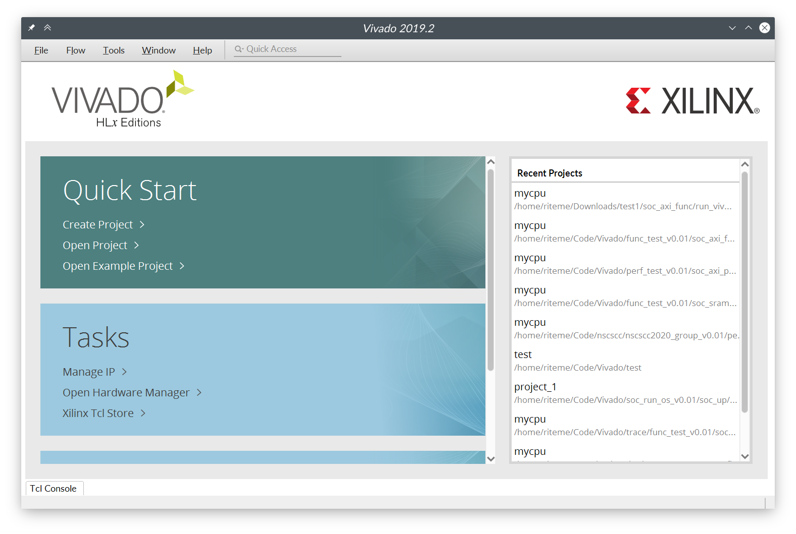
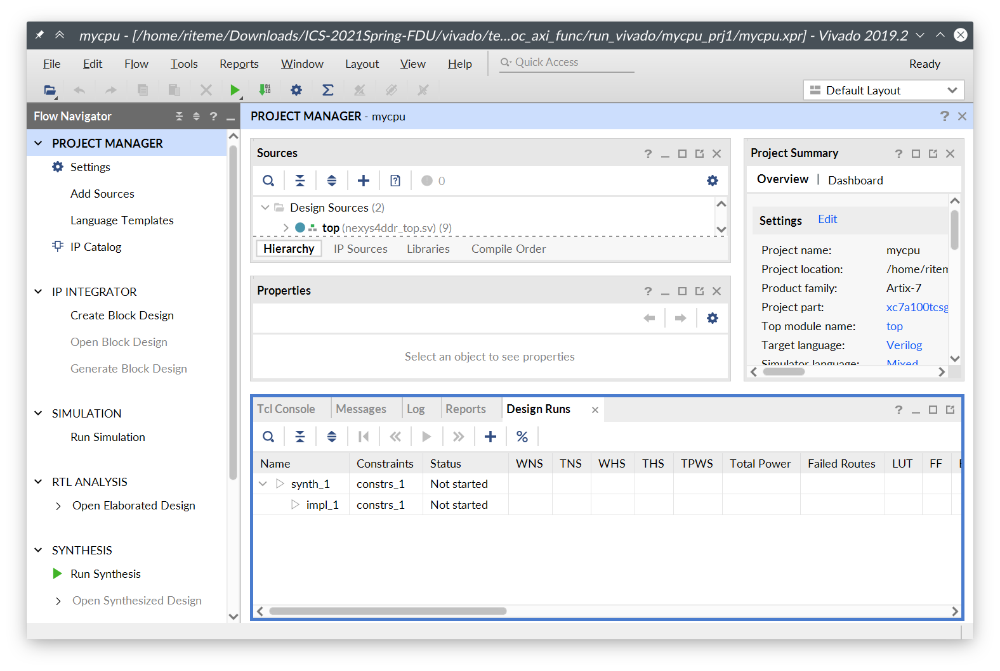
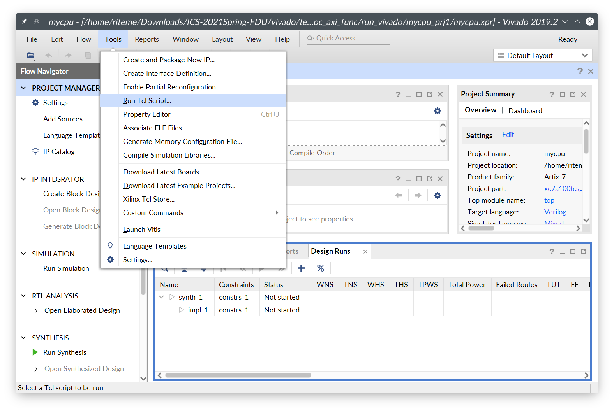
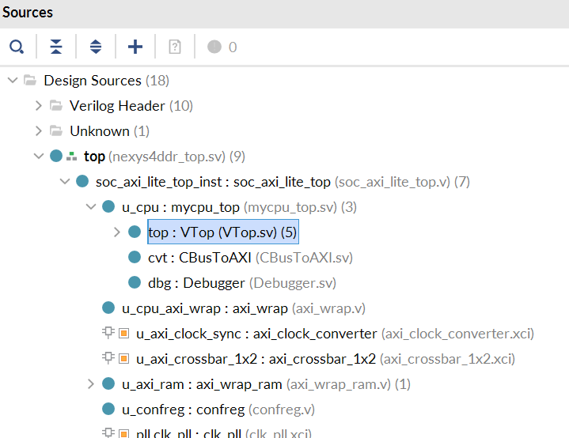
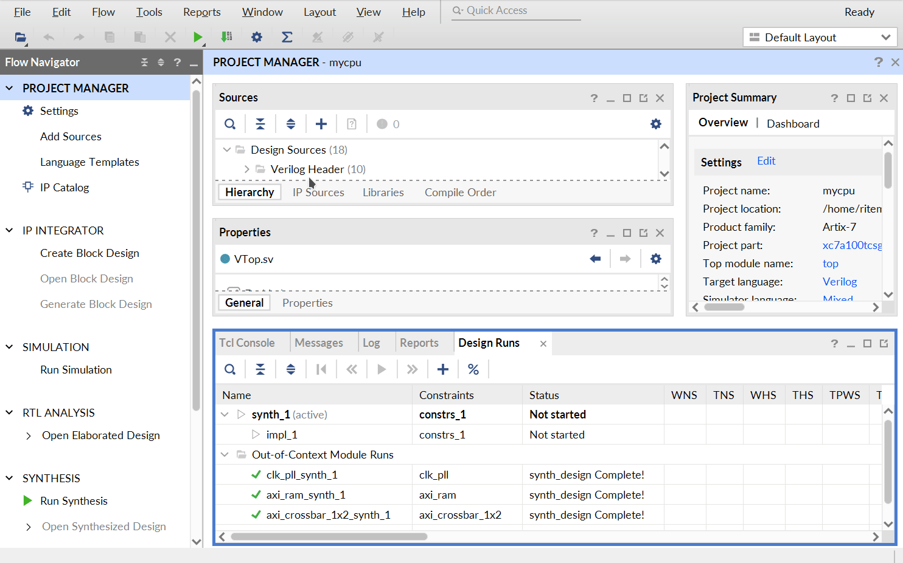

# 实验 0：开发环境

这个实验将指导你们准备后续实验的开发环境，并且运行我们提供的标准 CPU 实现（RefCPU），以方便大家熟悉开发和测试的流程。**本实验无需提交**。

## 安装 Vivado

本学期的实验要求统一使用 Vivado 2019.2。

Vivado 可以在 Windows 环境和 Linux 环境[^vivado-linux]下安装。请参见[龙芯杯的资料](../misc/external.md#2020-年龙芯杯文档)中的 “<i class="fa fa-file-pdf-o"></i> A6 - Vivado 安装说明” 来完成 Vivado 的安装。安装完成后，启动 Vivado 后应该能看到类似于下面的窗口：



### 对于 Linux 环境

如果你不想折腾 Vivado 的安装，可以找助教索要打包好的 Vivado 文件 “<i class="fa fa-file-zip-o"></i> xilinx.tar” 来省去下载和安装的步骤。

Linux 下 Vivado 的安装器不会安装 cable driver。我们需要手动安装 cable driver 后才能将 FPGA 开发板连接到 Vivado 上。请在终端中执行下面的命令来安装 cable driver：

```shell
export VIVADO_ROOT=/opt/xilinx/Vivado/2019.2
cd \$VIVADO_ROOT/data/xicom/cable_drivers/lin64/install_script/install_drivers
sudo ./install_drivers
```

`VIVADO_ROOT` 是 Vivado 的安装位置。如果在安装时没有改动安装位置，默认位置是 `/opt/xilinx/Vivado/2019.2`。

如果你安装完成后找不到 Vivado 的启动项，可以在终端中启动 Vivado：

```shell
cd \$VIVADO_ROOT
source ./settings64.sh
vivado
```

此外你可以考虑[制作一个桌面启动项](https://forums.xilinx.com/t5/Design-Entry/Can-t-launch-vivado-2018-3-in-ubuntu/m-p/935365/highlight/true#M23934)。

## 安装 Verilator

本学期的实验会引入 Verilator 作为 Vivado 外的另一个仿真器。除了 Verilator 本身外，我们还需要一些其它的软件包才能进行完整的仿真和调试的流程。请参考课程的 GitHub 仓库首页的 “<i class="fa fa-file"></i> README.md” 中的指示来安装这些软件包。

## 下载 Git 仓库

本学期的实验将会使用 Git 来做版本管理。你们的所有代码都将放在 Git 仓库中的指定位置，然后通过我们提供的脚本和 Vivado 工程文件（.xpr）来进行仿真和上板测试。因此，你需要在你的系统上安装 Git。想必很多同学都已经接触过 Git 了，因此这里就不再赘述 Git 的安装和配置流程了。

实验内容将在后续陆续放出。为了避免与你的工作 Git 分支有冲突，请避免直接在 master/main 分支以及 lab0、lab1、lab2、... 这些分支上做改动。我们建议你新建一个 dev 分支来编写你的代码：

```shell
git checkout -b dev
```

当有新的实验内容放出时（例如布置了实验 2），将你的 dev 分支 rebase 到新的实验的分支上：

```shell
git fetch origin
git checkout dev
git rebase origin/lab2
```

如果在 rebase 时发生冲突，请阅读 Git 输出的消息，并根据 Git 的指示解决冲突后，再使用 `git rebase --continue` 恢复 rebase 流程。直到没有冲突产生并且 rebase 完成为止。

## RefCPU

在 Git 仓库的 `source/refcpu` 目录下，有我们提供的标准 CPU（RefCPU）的源代码。RefCPU 是一个多周期 CPU，其可以通过龙芯杯的所有功能测试和性能测试。我们本学期的主要测试也是来自于龙芯杯的功能测试和性能测试，因此你可以用 RefCPU 来作为你的流水线 CPU 的对照。当然，我们不能保证 RefCPU 完全没有 BUG。如果 RefCPU 有不符合 [MIPS 标准](../misc/external.md#mips-架构)的行为，请以 MIPS 标准为准，并且可以向助教反馈。

接下来将使用 RefCPU 来运行一些测试，方便大家熟悉开发流程。

### 测试 1

在仓库的 `vivado` 目录下有来自龙芯杯的测试。以测试 1 为例，在 Vivado 中打开文件 `vivado/test1/soc_axi_func/run_vivado/mycpu_prj1/mycpu.xpr`：



然后点击顶部菜单栏的 “Tools” → “Run Tcl Script...”：



在弹出的对话框中选择 Git 仓库中的文件 `source/refcpu/add_sources.tcl`。这个 Tcl 脚本会将所有的 RefCPU 的源代码加入到 Vivado 的工程中。你可能注意到 `source/mycpu` 目录下也有个 `add_sources.tcl`，这个 Tcl 脚本就是以后加入你自己的 CPU 的源码时会用到的。源码加入后等待 Vivado 处理完成，就能在 “Sources” 窗口里看到新加入的源码/模块：



之后在左侧的 “Flow Navigator” 里面点击 “Run Simulation” → “Run Behavioral Simulation” 启动仿真。第一次仿真前因为需要综合 IP 核，所以可能比较慢，需要等待若干分钟才能启动[^generate-ip]。之后仿真的启动速度会快很多。



点击界面下侧的 “Tcl Console” 可以看到仿真测试的输出。如果测试通过，最后应该能在这里看到类似于下面的输出：

```plaintext
        [17532000 ns] Test is running, debug_wb_pc = 0xbfc100d8
        [17542000 ns] Test is running, debug_wb_pc = 0xbfc10178
        [17552000 ns] Test is running, debug_wb_pc = 0xbfc10218
        [17562000 ns] Test is running, debug_wb_pc = 0xbfc102bc
----[17563425 ns] Number 8'd29 Functional Test Point PASS!!!
        [17572000 ns] Test is running, debug_wb_pc = 0xbfc008f4
==============================================================
Test end!
----PASS!!!
\$finish called at time : 17579574500 ps : File "/home/riteme/Downloads/ICS-2021Spring-FDU/vivado/test1/soc_axi_func/testbench/mycpu_tb.v" Line 269
run: Time (s): cpu = 00:00:17 ; elapsed = 00:03:32 . Memory (MB): peak = 7061.156 ; gain = 0.000 ; free physical = 3362 ; free virtual = 19061
```

### 测试 1 上板

TODO

### Verilator 仿真

本学期会使用 Verilator 做一些额外的测试。你可以阅读附加资料中的 [Verilator 仿真](../misc/verilate.md)来了解一些基本的注意事项。

首先在 Git 仓库根目录打开一个终端，使用以下命令来用 RefCPU 跑龙芯杯的功能测试：

```shell
make vsim -j
```

最后应该能看到类似于下面的输出：

```plaintext
CONFREG: store: ignored unknown destination 0x8ffc.
CONFREG: store: ignored unknown destination 0x8ffc.
CONFREG: store: ignored unknown destination 0x8ffc.
CONFREG: load: ignored unknown destination 0x8ffc.
(info) #77 completed.
(info) #78 completed.
(info) #79 completed.
(info) #80 completed.
(info) #81 completed.
(info) #82 completed.
(info) #83 completed.
(info) #84 completed.
(info) #85 completed.
(info) #86 completed.
(info) #87 completed.
(info) #88 completed.
(info) #89 completed.
(info) testbench finished in 905987 cycles (599.199 KHz).
(warn) TextDiff: 7 error(s) suppressed.
```

然后用 RefCPU 运行龙芯杯性能测试中的 CoreMark：

```
make vsim -j VSIM_ARGS='--force-diff -m "./misc/nscscc/coremark.coe" -r "./misc/std/coremark.txt"'
```

最后应该能看到如下的输出：

```plaintext
./build/gcc/refcpu/VTop/vmain --force-diff -m "./misc/nscscc/coremark.coe" -r "./misc/std/coremark.txt"
CONFREG: store: ignored unknown destination 0x8ffc.
CONFREG: store: ignored unknown destination 0x8ffc.
CONFREG: store: ignored unknown destination 0x8ffc.
CONFREG: store: ignored unknown destination 0x8ffc.
CONFREG: load: ignored unknown destination 0x8ffc.
CONFREG: store: ignored unknown destination 0x8ffc.
CONFREG: store: ignored unknown destination 0x8ffc.
CONFREG: store: ignored unknown destination 0x8ffc.
CONFREG: store: ignored unknown destination 0x8ffc.
CONFREG: load: ignored unknown destination 0x8ffc.
coremark test begin.
arg : 0, 0, 102, 1, 7, 1, 2000
test start
computation done
2K performance run parameters for coremark.
CoreMark Size    : 666
Total ns : 24578460
Iterations/Sec : 40
COREMARK/MHZ = (1000000.0/CPU_COUNT_PER_US)*NSEC_PER_USEC*results[0].iterations/total_ns
It equals to 1000*1000*iteration/total_ns
In this run, iterate=1, total_ns=24578460

Total ticks      : 0
Total time (secs): 0
Iterations       : 1
Compiler version : GCC4.3.0
Compiler flags   :
Memory location  : Please put data memory location here
                        (e.g. code in flash, data on heap etc)
seedcrc          : 0xe9f5
[0]crclist       : 0xe714
[0]crcmatrix     : 0x1fd7
[0]crcstate      : 0x8e3a
[0]crcfinal      : 0xe714
Correct operation validated. See readme.txt for run and reporting rules.
coremark PASS!
coremark: Total Count(SoC count) = 0x2903e1
coremark: Total Count(CPU count) = 0x290399
(info) testbench finished in 2709066 cycles (612.085 KHz).
```

### 使用 GTKWave

TODO

---

[^vivado-linux]: 虽然 Xilinx 官方声明中只支持 Ubuntu，但实际上其它大多数 Linux 发行版都能正常安装和使用 Vivado。

[^generate-ip]: 你也可以在 “Sources” 的 “IP Sources” 一栏里面提前生成所有的 IP 核（选中所有 IP 核，右键并点击 “Generate Output Products”）。这样可以同时综合多个 IP 核，速度更快，并且不用综合完就可以仿真。
