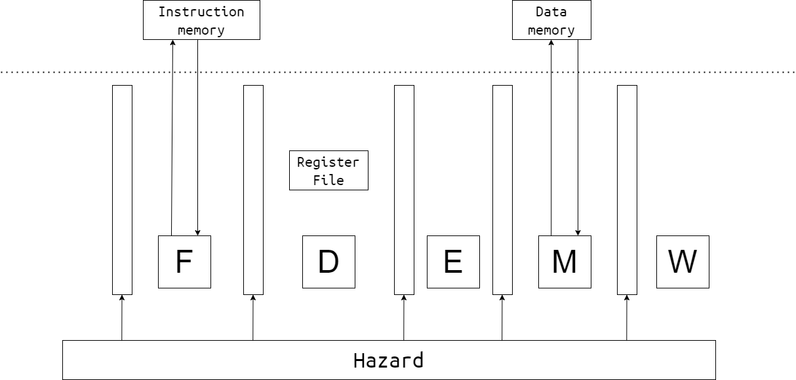
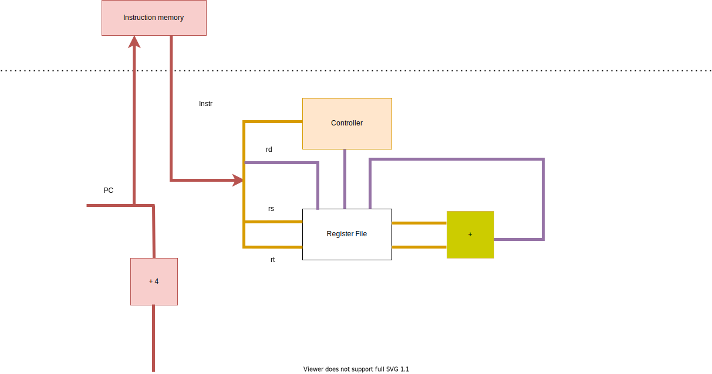
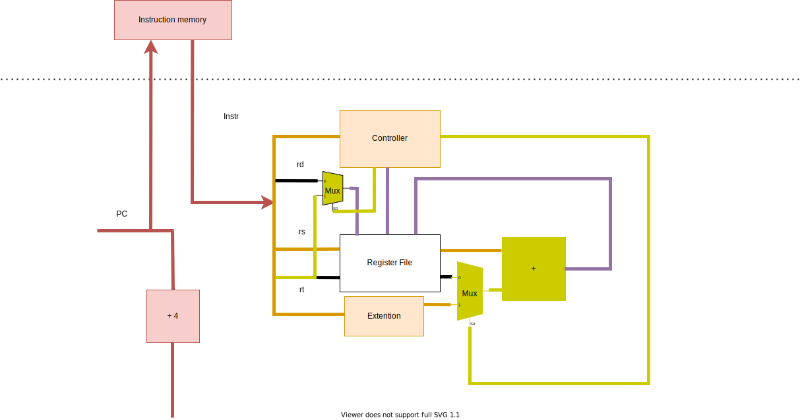
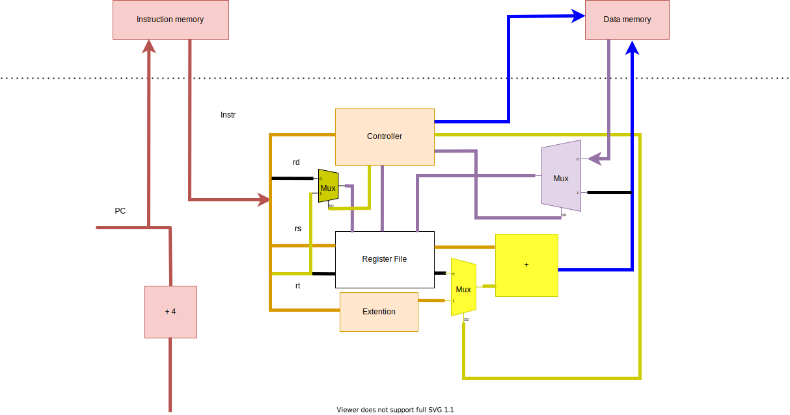

# 实验 1：五级流水线 MIPS CPU

> 先修内容：《深入学习计算机系统》Chapter 4: Pipelined Y86 CPU


## 1.1 MIPS 微体系结构

五级流水线，属于体系结构的范畴。不同指令集的 CPU，都可以有五级流水线的实现。

指令集是微体系结构的一部分，规范了指令编码等信息。

MIPS 属于精简指令集（Reduced Instruction Set Computing，RISC）。我们需要实现的 MIPS，部分基本信息如下：

* 每条指令长度为 4 字节（32 位）。
* 32 个通用寄存器，每个寄存器 32 位。0 号寄存器只读恒为 0。
* 内存读写的最小单位为 1 字节（8 位）。

### 1.1.1 MIPS 指令集

详见 [MIPS 手册 Ⅱ](../misc/external.md#mips-架构)：<i class="fa fa-file-pdf-o"></i> Volume II: MIPS32 Instruction Set。

这里介绍一下本实验中将要实现的部分指令：

------

`01ae5821		addu t3,t5,t6`

| [31:26]:000000       | [25:21]:01101 | [20:16]:01110 | [15:11]:01011 | [10:6]:00000 | [5:0]:100001 |
| -------------------- | ------------- | ------------- | ------------- | ------------ | ------------ |
| 指令类型：寄存器类型 | rs: t5        | rt: t6        | rd: t3        | 全 0          | ADDU         |

操作：`Reg[rd] ← Reg[rs] + Reg[rt]`

------

`25290001		addiu t1,t1,1`

| [31:26]:001001  | [25:21]:01001 | [21:16]:01001 | [15:0]:0000_0000_0000_0001 |
| --------------- | ------------- | ------------- | -------------------------- |
| 指令类型：ADDIU | rs: t1        | rt: t1        | 立即数 immediate            |

操作：`Reg[rt] = Reg[rs] + Sign_Extend(immediate)`

注意：该指令中的 u 表示寄存器为无符号的，是为了忽略溢出（和 C 语言的 `int`、`unsigned` 加法语义一致），立即数仍需符号位扩展。有一部分指令的立即数是 0 扩展。

------

`8d0c0000 lw t4,0(t0)`

| [31:26]:100011 | [25:21]:01000 | [20:16]:01100 | [15:0]:0000_0000_0000_0000 |
| -------------- | ------------- | ------------- | -------------------------- |
| 指令类型：LW   | base: t0      | rt: t4        | offset                     |

操作：

* `vaddr ← Reg[base] + Sign_Extend(offset)`
* `if (vaddr[1:0] != 2'b0) Exception(Address Exception)`（本实验中，可以保证 `vaddr` 是 4 字节对齐）
* `Reg[rt] ← LoadMemory(AddressTranslation(vaddr), size = WORD)`

------

`pc = bfc00704:  	0ff00f00		jal	bfc03c00 <n1_lui_test>`

| [31:26]:000011                 | [25:0]:11_1111_0000_0000_1111_0000_0000 |
| ------------------------------ | --------------------------------------- |
| 指令类型：JAL（jump and link） | instr_index                             |

操作：

* `Reg[31] ← pc + 8`
* 执行下一条指令时：`pc ← {pc[31:28], instr_index, 2'b00}`

JAL 指令常用于函数调用。

```mips
# note: in MIPS, branch-type instructions (including j, beq) have a delay slot.

sample1:
beq zero, zero, here # branch if equal
instruction1
instruction2

here:
instruction3

# sequence is: beq -> instruction1 -> instruction3


sample2:
bne zero, zero, there # branch if not equal
instruction 4
instruction 5
instruction 6

there:
instruction 7

# sequence is: bne -> instruction 4 -> instruction 5
```

本实验需要实现的指令：`lui`、`addu`、`addiu`、`beq`、`bne`、`lw`、`or`、`slt`、`slti`、`sltiu`、`sll`、`sw`、`j`、`jal`、`jr`、~~`addi`~~、`subu`、`sltu`、`and`、`andi`、`nor`、`ori`、`xor`、`xori`、`sra`、`srl`、~~`jalr`~~。

### 1.1.2 虚实地址转换

指令代码、寄存器中的地址都是虚拟地址。CPU 向内存请求时，需要提供物理地址。

本实验中，只要求实现简单的虚实地址转换。

```verilog
typedef logic [31:0] paddr_t;
typedef logic [31:0] vaddr_t;

paddr_t paddr; // physical address
vaddr_t vaddr; // virtual address

assign paddr[27:0] = vaddr[27:0];
always_comb begin
    unique case (vaddr[31:28])
        4'h8: paddr[31:28] = 4'b0; // kseg0
        4'h9: paddr[31:28] = 4'b1; // kseg0
        4'ha: paddr[31:28] = 4'b0; // kseg1
        4'hb: paddr[31:28] = 4'b1; // kseg1
        default: paddr[31:28] = vaddr[31:28]; // useg, ksseg, kseg3
    endcase
end
```

亦可以参考 RefCPU 中模块 `AddressTranslator` 的实现。

例如，当指令访问地址 `0xbfc00380` 时，实际访问的物理地址应该是 `0x1fc00380`。详见 [MIPS 手册 Ⅲ](../misc/external.md#mips-架构)：<i class="fa fa-file-pdf-o"></i> Volume III: MIPS32 Privileged Resource Architecture，第 29 页。

## 1.2 五级流水线

五级流水线的简单示意图如下：



虚线上方为内存部分的硬件，由测试文件提供。

写 CPU，就是实现 CPU 的内部，并用事先定好的接口进行封装。

### 1.2.1 Select PC

这一阶段在 Fetch Pipeline Register 前，选择流水线所执行的下一条指令的 PC。

可能的来源：

* 顺序的下一条指令（PC + 4）
* jump 类指令（`{pc[31:28], instr_index, 2'b00}`）

等等。

### 1.2.2 Fetch

向 Instruction Memory 提供指令地址，并接收指令。

注意：本实验中，内存有 1 周期的固定延迟。

其行为类似于：

```verilog
logic [127:0][31:0] memory;
logic [6:0] addr;
logic [31:0] data;
always_ff @(posedge clk) begin
    data <= memory[addr];
end
```

可考虑把接受的数据直接接到下一流水段。

### 1.2.3 Decode

D 阶段完成：

* 指令解码，生成控制信号
* 从 Regfile（寄存器文件堆）中读取数据
* 判断是否跳转

### 1.2.4 Execute

E 阶段主要为 ALU。

### 1.2.5 Memory

M 阶段向 Data Memory 提供数据地址，并接收数据。

注意：本实验中，内存有 1 周期固定延迟。

### 1.2.6 Writeback

W 阶段向 Regfile 写数据。

### 1.2.7 Regfile

根据 MIPS 指令集架构，每条指令最多写 1 个通用寄存器，最多读 2 个通用寄存器。所以 Regfile 应设计为 1 个写端口，2 个读端口。

参考代码：

```verilog
typedef logic[31:0] word_t;
typedef logic[4:0] creg_addr_t;

module regfile(
	input logic clk,
    input creg_addr_t ra1, ra2, wa3,
    input logic write_enable,
    input word_t wd3
    output word_t rd1, rd2
);
    word_t [31:1] regs, regs_nxt;

    // write: sequential logic
    always_ff @(posedge clk) begin
        regs[31:1] <= regs_nxt[31:1];
    end
    for (genvar i = 1; i <= 31; i ++) begin
        always_comb begin
            regs_nxt[i[4:0]] = regs[i[4:0]];
            if (wa3 == i[4:0] && write_enable) begin
                regs_nxt[i[4:0]] = wd3;
            end
        end
    end


    // read: combinational logic
    assign rd1 = (ra1 == 5'b0) ? '0 : regs[ra1]; // or regs_nxt[ra1] ?
    assign rd2 = (ra2 == 5'b0) ? '0 : regs[ra2];

endmodule
```

### 1.2.8 Pipeline register

五级流水线中，会有阻塞与气泡，所以流水线寄存器需要提供这些机制。

参考代码：

```verilog
typedef struct packed {
    logic a;
} fetch_data_t;

module dreg (
	input logic clk, resetn,
    input fetch_data_t dataF_new,
    input logic enable, flush,
    output fetch_data_t dataF
);
    always_ff @(posedge clk) begin
        if (~resetn | flush) begin // flush overrides enable
            dataF <= '0;
        end else if (enable) begin
            dataF <= dataF_new;
        end
    end
endmodule
```

Tips：

* W 阶段流水线寄存器不允许被阻塞。
* F 阶段流水线寄存器一般不清零；**PC的复位值为 `32'hbfc0_0000`**。
* M 阶段流水线寄存器阻塞时（因），E 阶段流水线寄存器通常也阻塞（果），防止丢失指令。
* E 阶段流水线寄存器阻塞时（因），M 阶段流水线寄存器通常清零（果），防止指令被执行多次。

### 1.2.9 Hazard and Forward

这个部分代码量可能不大，但应该是本实验中最复杂的部分。

主要难点是数据冲突。本实验中，仅需考虑写后读（RAW）冲突。请思考：

* 冲突阻塞部分：D 阶段取数据，E、M、W 阶段的写数据会造成冲突。哪些情况应当阻塞流水线？
* 转发部分：哪些指令写通用寄存器？电路图中的哪些数据线可作为转发来源？转发条件是什么？优先级是什么？

分支预测失败的情况比较简单。D 阶段判断分支是否跳转；由于 delay slot 的设计，F 阶段的指令一定执行。所以，分支跳转不会有额外的惩罚（数据冲突可能存在）。

### 1.2.10 封装 CPU

本实验的 CPU 的最顶层封装为 SRAM 接口。见 `source/mycpu/mycpu_top.sv`。

```verilog
module mycpu_top (
    input logic clk,
    input logic resetn,  //low active
    input logic[5:0] ext_int,  //interrupt,high active

    output logic inst_sram_en,              // 指令内存总使能
    output logic[3:0] inst_sram_wen,        // 字节写使能，本实验中为全0
    output logic[31:0] inst_sram_addr,      // 地址
    output logic[31:0] inst_sram_wdata,     // 写数据
    input logic[31:0] inst_sram_rdata,      // 读数据

    output logic data_sram_en,              // 数据内存总使能
    output logic[3:0] data_sram_wen,        // 字节写使能，本实验中为全0或全1
    output logic[31:0] data_sram_addr,      // 地址
    output logic[31:0] data_sram_wdata,     // 写数据
    input logic[31:0] data_sram_rdata,      // 读数据

    //debug
    output logic[31:0] debug_wb_pc,         // w阶段pc
    output logic[3:0] debug_wb_rf_wen,      // 写使能，一般为全0或全1
    output logic[4:0] debug_wb_rf_wnum,     // 写入的寄存器
    output logic[31:0] debug_wb_rf_wdata    // 写回的数据
);
    // TODO: other circuit

endmodule
```

为了保证和后续实验在接口上的统一，我们在 CPU 内部统一使用 DBus 接口。在 `source/mycpu/SRAMTop.sv` 做了从 DBus 接口到类 SRAM 接口的转换。DBus 接口定义在 `source/include/common.svh` 中：

```verilog
typedef struct packed {
    logic    valid;   // 是否有请求？
    addr_t   addr;    // 请求读写的地址
    msize_t  size;    // 读写数据的大小：1、2 或者 4 字节，分别对应 MSIZE1、MSIZE2 和 MSIZE4
    strobe_t strobe;  // 4 位的字节写使能信号
    word_t   data;    // 如果写使能不为全 0，这里放写入的数据
} dbus_req_t;

typedef struct packed {
    logic  addr_ok;  // 内存是否已经接收了地址？
    logic  data_ok;  // 内存是否完成了访存？
    word_t data;     // 请求地址处读出的数据
} dbus_resp_t;
```

对于本次实验，因为访存是固定延时，并且所有读写的数据以及指令访存都是 4 字节的，所以

* `dbus_resp_t` 中的 `addr_ok` 和 `data_ok` 信号实际上可以忽略。
* `addr` 最低两位应该始终为 0，即地址与 4 字节对齐。
* `size` 始终为 `MSIZE4`。
* 写操作时 `strobe` 为 `4'b1111` 或 `4'hf`。

你可能会注意到还有一个 IBus 接口。IBus 接口是 DBus 接口的子集，只保留了读取数据所需要的信号。此外，你的流水线部分的顶层模块文件应该是 `source/mycpu/MyCore.sv`。我们建议你将你的流水线分为多个模块来实现。你可以在 `source/mycpu` 这个目录下新建文件或者子目录。

你可以选择在模块 `SRAMTop` 中做地址翻译，或是在模块 `MyCore` 中做地址翻译。

### 1.2.11 连接 `debug_*` 信号

龙芯杯的测试会进行 trace 的比对。这需要从你的流水线中读取一些数据。我们在 1.2.10 一节中已经看到 `mycpu_top` 最后有四个 `debug_*` 信号了。为了避免增加下层模块的接口，我们建议你使用跨模块引用来连接这些 `debug_*` 信号。例如：

```verilog
// in mycpu_top.sv
assign debug_wb_pc     = top.core.writeback.pc;
assign debug_wb_rf_wen = top.core.writeback.aha ? 4'b1111 : 4'b0;
```

## 1.3 数据通路与译码控制信号

CPU 需要一系列硬件来执行指令所要求的功能。如果 CPU 只支持一条指令，那么 CPU 内所有的硬件都只为这一个功能所服务。随着指令条数的增加， CPU 设计者会添加一些硬件，同时也会复用一些原有的硬件。随着这些硬件复用性的提升， CPU 的数据通路会变得更复杂。Decode 阶段的译码器为这些硬件提供控制信号，这些控制信号也是高度复用的。

我们设计的第一条指令是 `addu`。只支持这一条指令的流水线，是比较简单的：



随后，我们加入了 `addiu`。Execute 阶段的加法器可以被复用，但源操作数不再是两个寄存器的值，而是一个寄存器和一个立即数；目的寄存器也不再是 `rd`， 而是 `rt`：



`lw` 指令通过一个加法器算出数据的虚拟地址，这个加法器可以使用已有的加法器。然而，写入寄存器的数据不再是加法器，而是数据内存：



添加了 `jal` 指令后，下一条指令的 PC 不再只可能是 (PC + 4)；写入的寄存器被指定为 31 号寄存器，数据则是指定为 (PC + 8)：


当 CPU 需要支持新的指令时，根据该指令的功能，设计数据通路，并视具体情形添加或复用硬件与控制信号。添加硬件，会增加 CPU 的电路面积；复用原有硬件，会增加复用器的电路复杂性，增加电路延迟。

添加新硬件时，需考虑将该硬件放在流水线的哪一阶段，避免影响该流水段的逻辑延迟。

## 1.4 发布包

用 Vivado 2019.2 打开 `vivado/test1_naive/soc_sram_func/run_vivado/mycpu_prj1/mycpu.xpr`，添加源文件后，即可开始仿真。

Tips：第一次仿真前，先点击 “IP Sources”，选中所有 IP 核源文件，右键，点击 “Generate Output Products”。几秒钟后，跳出 “OK”，然后再点仿真。

`vivado/test1_naive/soft/obj/test.s` 是测试的反汇编文件，有 PC、机器码、汇编码的对应。`soft` 目录下的其他文件里，可以找到测试的 C 代码。

`source/mycpu/` 里已经有一些代码，其中：

* `mycpu_top.sv` 是顶层封装文件，仅需把 debug 信号连接上。
* `SRAMTop.sv` 是 SRAM 接口封装文件，需要添加虚实地址翻译。
* `MyCore.sv` 是 CPU 主体流水线文件。

你可以在该目录下随意添加源文件。在 Vivado 中执行 `add_sources.tcl` 后，它们都会添加到项目里。

`source/include/` 里有一些头文件。

**本次实验没有暂时没有使用 Verilator 进行仿真**。我们会从实验 2 开始引入 Verilator，所以你需要确保你的在这次实验中编写的代码能够通过 Verilator 的编译。如果在使用 Verilator 中遇到了问题，请先阅读 [Verilator 仿真](../misc/verilate.md)寻找解决方案。

## 1.5 作业与提交

在 `source/mycpu/` 里添加你的代码，实现五级流水线 MIPS CPU。

本实验需要实现的指令：`lui`、`addu`、`addiu`、`beq`、`bne`、`lw`、`or`、`slt`、`slti`、`sltiu`、`sll`、`sw`、`j`、`jal`、`jr`、~~`addi`~~、`subu`、`sltu`、`and`、`andi`、`nor`、`ori`、`xor`、`xori`、`sra`、`srl`、~~`jalr`~~。

**PC的复位值为 `32'hbfc0_0000`**。

### 1.5.1 通过标准

1. 打开原有 `mycpu.xpr`，用 `source/mycpu/add_sources.tcl` 添加源文件，上板显示两个绿灯。
2. 在仓库根目录打开终端，运行 `make verilate TARGET=mycpu/VTop`，确认 Verilator 能够编译你的 CPU 代码，并且没有报告任何错误和警告。

### 1.5.2 实验报告要求

* 格式：PDF
* 内容：按本文档 1.2 节的思路写即可。写好姓名学号。

### 1.5.3 提交文件格式

```plaintext
18307130024/
├── report/（报告所在目录）
└── source/（源文件所在目录）
```

用 `zip -r 18307130024.zip 18307130024/` 打包。用 `unzip 18307130024.zip` 检查，应在当前目录下有学号目录。

### 1.5.4 评分

代码 80%，报告 20%。

**Deadline：2020 年 3 月 21 日 23:59:59**

## 1.6 思考

1. 流水线寄存器的 flush 信号，需要让所有信号都清零吗？
2. 转发的成本是什么？有哪些限制？（板子上的组合逻辑基本部件为 LUT6 ，6 输入 1 输出，可实现 6 输入的任何给定逻辑式）
3. 不同指令需要用到的流水线阶段可能不同：加法指令似乎不需要经过 Memory 阶段。能让它跳过 M 阶段吗？
