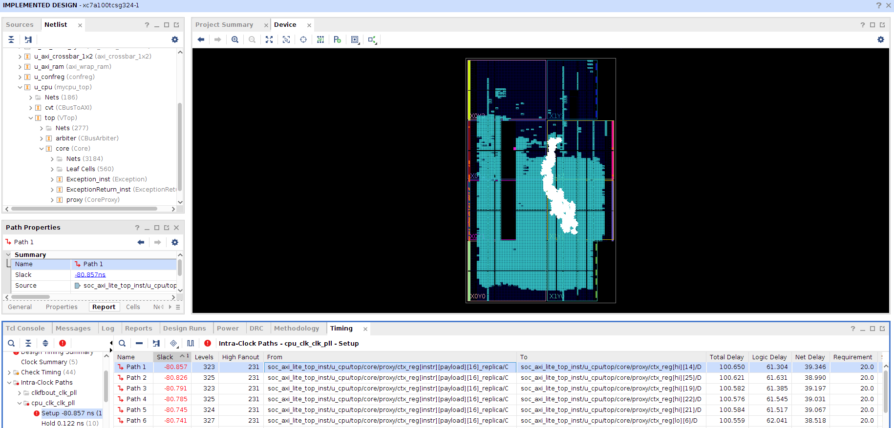

# 实验 2b：乘除法指令

增加乘除法指令和 `HI`、`LO` 寄存器，上板通过 `test3` 的测试。请自行翻阅[指令列表](../misc/instruction.md)和 [MIPS 指令手册](../misc/external.md#mips-架构)。

## 实验提交

**本实验和实验 2a 一起提交。**

## 基本实现

两个32位数相乘的结果是64位，相除的结果包括32位商和32位余数。

MIPS 引入两个新的32位寄存器：`HI` 和 `LO` 来存储这64位结果。

这两个的寄存器写法和通用寄存器类似：

```verilog
module hilo (
    input logic clk,
	output i32 hi, lo,
    input i1 hi_write, lo_write,
    input i32 hi_data, lo_data
);
    i32 hi_new, lo_new;
    always_comb begin
        {hi_new, lo_new} = {hi, lo};
        if (hi_write) begin
            hi_new = hi_data;
        end
        if (lo_write) begin
            lo_new = lo_data;
        end
    end
    always_ff @(posedge clk) begin
        {hi, lo} <= {hi_new, lo_new};
    end
endmodule
```

以下是单周期乘除法器的一个参考写法：

```verilog
module mult (
    input i32 a, b,
    input decoded_op_t op,
    output i32 hi, lo
);
    i64 ans;
    always_comb begin
        case (op)
            MULTU: begin
                ans = {32'b0, a} * {32'b0, b};
                hi = ans[63:32]; lo = ans[31:0];
            end
            MULT: begin
                ans = signed'({{32{a[31]}}, a}) * signed'({{32{b[31]}}, b});
                hi = ans[63:32]; lo = ans[31:0];
            end
            DIVU: begin
                ans = '0;
                lo = {1'b0, a} / {1'b0, b};
                hi = {1'b0, a} % {1'b0, b};
            end
            DIV: begin
                ans = '0;
                lo = signed'(a) / signed'(b);
                hi = signed'(a) % signed'(b);
            end
            default: begin
                {hi, lo, ans} = '0;
            end
        endcase
    end
endmodule
```

## * 进阶：多周期乘除法器

32位乘除法器的逻辑十分复杂，其单周期的实现延迟极高。





### 截止时间

**2021 年 4 月 11 日 23:59:59**

## *扩展内容

* 李四发现 Verilator 仿真的 CONFREG 模块提供了简单的串口交互接口：地址 `0xbfaf1000` 用于在串口上读写字符，地址 `0xbfaf1014` 用于检查是否有未读入的字符。于是李四在 `misc/echo` 下编写了一个汇编程序 `echo.s`，它会将你在终端上输入的字符显示出来。请先尝试将 `echo.s` 编译成 `.coe` 文件。

  打开一个终端，在仓库根目录下运行 `make vpty`。这个命令会使用 `socat` 在 `build` 目录下创建一个虚拟控制台（pty）。然后再打开一个终端，运行：

  ```shell
  make vsim -j TARGET=mycpu/VTop VSIM_ARGS="-m [.coe 文件路径]"
  ```

  此时 `vmain` 会自动接入到之前 `make vpty` 创建的虚拟控制台的一端，并且会在仿真的终端打印一行 “`CONFREG: connected to pty "build/vpty".`”。最后再打开一个终端，运行串口软件。以 GNU `screen` 为例：

  ```shell
  screen build/pty
  ```

  然后尝试输入字符，你会看到这些字符在串口软件的终端里能显示出来。此时如果杀死 `vmain` 进程，再到串口软件上输入时，就看不到新输入的字符了。

  此时，你<del>李四</del>可以尝试编写在终端上交互的程序了。李四的 `echo.s` 还不支持 backspace 键，你可以思考一下如何实现 backspace。

  **提示**：你可以使用 `showkey` 查看键盘上每个按键对应的 ASCII 码。
* 李四学会了 C 语言，于是他在 `misc/greet` 目录下写了一份 C 程序 `greet.c`。这个程序会读入一行文字，比如 “Gromah”，当你按下回车后，程序会在下一行中显示 “Hello, Gromah!”。请尝试将这个程序编译到 `.coe` 文件，并在你的 CPU 上运行。
