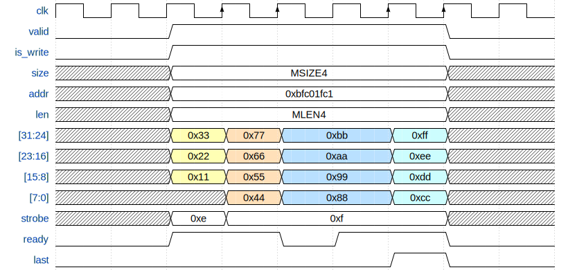

# 实验 3a：高速缓存

高速缓存（cache）对于 CPU 性能十分重要。如果没有缓存，流水线做的所有优化都是徒劳的。本次实验需要实现第一级缓存中的数据缓存（L1d）。由于我们的 CPU 的取指和访存的需求基本一致，因此 L1d 可以直接拿来当 L1i 使用。


上图是目前消费级多核处理器中非常常见的缓存架构。`lscpu -C` 命令可以列出你的 CPU 上各级缓存的信息：

```plaintext
\$ lscpu -C
NAME ONE-SIZE ALL-SIZE WAYS TYPE        LEVEL SETS PHY-LINE COHERENCY-SIZE
L1d       32K     128K    8 Data            1   64        1             64
L1i       32K     128K    8 Instruction     1   64        1             64
L2       256K       1M    4 Unified         2 1024        1             64
L3         8M       8M   16 Unified         3 8192        1             64
```

缓存是利用程序局部性原理的经典例子。32KiB 的 L1d 和 L1i 足以在龙芯杯的性能测试得到 99% 的缓存命中率。

## L1i & L1d

一级缓存分为指令缓存和数据缓存，分别服务于取指和访存阶段。原则上 L1i 是只读的，并且不会有程序在运行过程中写入新的指令[^jit]，因此我们不需要考虑两个缓存之间同步的问题。

## 实现 L1d

本次实验要求 L1d 是写分配（write-allocate）以及写回（write-back）缓存。接下来我们将介绍 L1d 的基本结构。

### Cache Line

Cache line 包含一段连续的内存的副本，一般情况下它的大小是一个 2 的幂次，并且起始地址和大小对齐。当缓存从内存中读取出一条 cache line 时，缓存可以利用内存的突发传输特性，从而降低每个字节的平均读取延时。我们使用的 32 位 AXI 总线一般可以支持单次最高 16×4 = 64 字节的突发传输，因此我们也建议你在性能测试中使用大小为 64 字节的 cache line。从 L1i 的角度来看，相当于每条 cache line 放了 16 条指令。

如果选择大小为 64 字节的 cache line，那么内部的偏移量（offset）需要 6 位。对于 L1i，由于指令都是和 4 字节对齐的，因此只需要 4 位。


### Cache Set

前面说的 cache line 是缓存和内存交互的基本单元。缓存将内存视为一大堆 cache line 的集合。之后我们需要考虑如何在缓存中索引 cache line。

最常见的做法是把缓存分为若干个桶，每个桶内可以存放一定数量的 cache line，有点类似于哈希表。这些桶在缓存的术语中叫做 cache set。一般地址中除去 offset 后最低的几位会被拿来当作 cache set 的索引（index）：


每个 cache set 内能同时存储的 cache line 条数称为关联度（associativity）。显然关联度至少为 1。常见的关联度有 2、4、8（也就是所谓的 2 路、4 路、8 路缓存）。由于很多的 cache line 会被映射到同一个 cache set 内，我们必须用地址中剩下的位对它们进行区分。这些位通常也称作标签（tag）：


当我们索引 cache line 时，通常会在 cache set 内并行地比较 tag。因此，关联度太大会导致缓存中比较器消耗的硬件资源过多，反而会降低缓存性能。

> **为什么使用低位作为索引值？**
>
> 看一个现实生活中的例子：
>
> 
> <center class="fig-caption">（杨浦区某快餐店的外卖暂存区。右下角应该是数字 “9”）</center>
>
> 上图中货架上每个数字下面写着 “订单尾号”。
>
> 该快餐店的订单号是按顺序生成的。因此用低位作为索引有助于充分利用货架上的每个隔间。也正因为顺序生成的订单号，所以在一段时间内产生的外卖的订单号的高位都是一样的。如果用高位，就会导致大量的外卖放在同一层内。

总结一下：

* offset 用于 cache line 内的寻址。
* index 用于索引到 cache set。
* tag 用于区分同一个 cache set 内不同的 cache line。

### 替换策略

缓存的大小通常远小于内存的大小，所以一个程序运行过程中所需要用到的所内存大概率不能都放入缓存中。缓存的主要目标是把程序近期会用到的内存全部装入缓存，这些内存通常也称为工作集（working set）。因此，缓存经常需要把不常用的 cache line 从缓存中清出去，为接下来需要访问的 cache line 腾出空间。

举个例子，对于一个 4 路缓存，某个 cache set 已经有 4 条 cache line 了，然后 CPU 访问的下一个地址对应的 cache line 不在缓存中，但也是映射到这个 cache set 的。此时缓存必须把这个 cache set 内已有的某条 cache line 替换掉，从而能够存放新的 cache line。那么此时应该将哪条 cache line 替换出去呢？

想必各位在 ICS 课上已经了解过各种替换策略了，因此这里不会再一一列举。简单来说，如果我们知道程序的访存顺序，那么我们只需要将下次访问时间最晚的 cache line 替换掉即可。这个贪心算法可以证明是最优的。但显然我们无法准确得知程序的行为。LRU 算法和它的各种变种是缓存中常用的替换算法。LRU 在大多数情况下的效果都比较接近最优贪心算法的效果[^lru]。最原始的 LRU 算法需要维护 cache set 内每条 cache line 的顺序，在硬件上实现可能比较消耗资源，因此出现了一些 LRU 的变种算法。此外，随机替换策略在缓存关联度足够大的时候也有不错的表现。并且随机替换不需要在访存缓存时更新替换算法的状态，也不需要每个 cache set 都存放额外信息。相比于 LRU 系列，随机替换可以节约大量的硬件资源。

本次实验中你可以实现任意的替换策略。

### 状态机

缓存的状态机可以有两种理解：

1. 缓存本身是一个大的状态机，下面管着很多的 cache line。
2. 缓存先索引到一个 cache line，然后每条 cache line 都有一个独立的状态机。

在我们的实验中，上面两种理解没有太大区别。对于有多个端口且支持并发访问的缓存而言（例如 L2），可能第二种理解更加贴切。

Cache line 有三种基本的状态[^mosei]：

* Invalid：无效状态。这条 cache line 还没有被装入任何有效的数据。
* Valid：有效状态。这条 cache line 中有数据，且和内存中的内容相同。
* Dirty：已被写入状态。这条 cache line 中有数据，但是先前被 CPU 写入了新的数据，导致 cache line 中的内容和内存中对应位置处的内容不一致。

这三种状态一般称为稳定状态（stable states）。当然，从 invalid 变到 valid 需要进行一次突发传输，这需要经过多个周期才能完成，因此需要设立额外的过渡状态（transient states）。

你需要设计一个维护每条 cache line 状态的状态机。具体而言，你的状态机至少需要能处理下面几种事件：

* 缓存命中（cache hit）：CPU 发出请求，并且在缓存内找到了对应的处于 valid/dirty 状态的 cache line。
* 缓存不命中（cache miss）：CPU 发出请求，但是没有找到对应的处于 valid/dirty 状态的 cache line。
* 读取 cache line：突发传输中返回了新的数据。
* 写回 cache line：当 dirty 的 cache line 被替换时，需要使用突发传输将整个 cache line 写回到内存中。

### 存储和索引

对于每条 cache line，我们需要存储：

* cache line 的数据。
* cache line 的 tag、状态信息。通常称为元数据（metadata）。

对于每个 cache set，你需要存储一个 cache line 的数组。

假设 index 和 offset 都是 6 位，关联度为 4，下面是一个简略的实现：

```verilog
typedef i20 tag_t;
typedef i6 index_t;
typedef i6 offset_t;
typedef i2 position_t;  // cache set 内部的下标

typedef struct packed {
    tag_t tag;
    logic valid;  // cache line 是否有效？
    logic dirty;  // cache line 是否被写入了？
} meta_t;
typedef meta_t [3:0] meta_set_t;

typedef word_t [15:0] cache_line_t;
typedef cache_line_t [3:0] cache_set_t;

// 存储单元（寄存器）
meta_set_t [63:0] meta;
cache_set_t [63:0] data;

// 解析地址
tag_t tag;
index_t index;
offset_t offset;
assign {tag, index, offset} = dreq.addr;

// 访问元数据
meta_set_t foo;
assign foo = meta[index];

// 搜索 cache line
position_t position;
always_comb begin
    position = 2'b00;  // 防止出现锁存器

    unique if (foo[0].tag == tag)
        position = 2'b00;
    else if (foo[1].tag == tag)
        position = 2'b01;
    else if (foo[2].tag == tag)
        position = 2'b10;
    else if (foo[3].tag == tag)
        position = 2'b11;
end

// 访问 cache line
cache_line_t bar;
assign bar = data[index][position];
assign dreq.data = bar[offset[5:2]];  // 4 字节对齐
```

针对缓存的实现，我们有如下的建议：

* **实现参数化**。主要是为了方便修改缓存的大小。你可以在 `DCache` 模块的声明处添加自定义的参数，例如：

    ```verilog
    module DCache #(
        parameter int OFFSET_BITS = 4,
        parameter int INDEX_BITS = 2,

        localparam int TAG_BITS = 32 - OFFSET_BITS - INDEX_BITS
    ) (
        // 接口列表
    );
    ```

    上面的 `parameter` 是外部可以改动的参数，例如

    ```verilog
    DCache #(.OFFSET_BITS(6)) dcache_inst(.*);
    ```

    而 `localparam` 仅限模块内部使用，类似于常量值（比如 C++ 中的 `constexpr`）。
* **强烈建议初次调试时不要使用太大的缓存**。我们推荐最开始调试的时候使用 4 位的 offset 和 2 位的 index，并且关联度不要超过 4。这相当于每条 cache line 存储 4 条指令，缓存中只有 4 个 cache set。过长的 cache line 会让突发传输的过程太长，而过多的 cache set 和过大的关联度会增加在缓存中寻找问题的难度。一般 4 个足以测试出绝大部分的问题。
* \*使用 LUTRAM 存储 cache line。我们在 `source/ram` 目录下提供了 `LUTRAM.sv` 和 `LUTRAMTest.sv`，它们分别是 LUTRAM IP 核的封装和测试[^bram]。使用 LUTRAM 可以大幅减少你的缓存消耗的硬件资源。你可以在 Vivado 中观察 `LUTRAMTest.sv` 的仿真波形图，或者是阅读 `LUTRAM.sv` 内的行为级模型的 SystemVerilog 代码，来了解 LUTRAM 的行为。我们也提供了 `source/refcpu/StupidBuffer.sv` 作为使用 LUTRAM 的示例。

## 接口

缓存是放在 CPU 流水线和内存之间的，因此：

* 缓存对 CPU 提供一个 DBus 的接口，并且保证缓存是透明（transparent）的。即从 CPU 来看，无论有没有缓存，访存的接口应该都是一致。
* 缓存在内存这边使用 CBus 接口，方便利用突发传输。

### 缓存总线（CBus）

CBus 是对 AXI 总线突发传输接口的简化。

```verilog
typedef struct packed {
    logic    valid;     // 是否发出请求
    logic    is_write;  // 是否是写请求
    msize_t  size;      // 单次传输的字节数
    addr_t   addr;      // 突发传输起始地址
    strobe_t strobe;    // 单次传输中的写使能信号
    word_t   data;      // 单次传输中的写数据
    mlen_t   len;       // 总传输次数
} cbus_req_t;

typedef struct packed {
    logic  ready;  // 上一次传输是否完成
    logic  last;   // 最后一次传输是否完成
    word_t data;   // 单次传输读取的数据
} cbus_resp_t;
```

CBus 的突发传输实际上就是 AXI 总线中的 WRAP 类型的突发传输。在 AXI 总线中，每次突发传输称为一次事务（transaction）。事务内可以有多次数据传输的总线握手（burst）。

事务有几个基本属性：

* 是否有效：`valid` 为 1 表明事务有效。
* 写事务/读事务：由 `is_write` 决定。
* 单次读写大小：由 `size` 决定。可以为 `MSIZE1`（单字节）、`MSIZE2`（双字节）或者 `MSIZE4`（4 字节）。
* 起始地址：由 `addr` 给出。
* 总传输/握手次数：由 `len` 给出。可以为 `MLEN1`、`MLEN2`、`MLEN4`、`MLEN8` 和 `MLEN16` 中的一种。

**以上 5 项作为事务的属性，在事务进行中是不能变更的**。

和 DBus 类似，CBus 的握手也是在时钟周期上升沿时进行的。其中 `ready` 为 1 表示操作完成，而 `last` 为 1 表明这是这个事务中最后一次握手。当 `last` 为 1 的握手完成之后，如果接下来没有其它事务需要进行了，那么 `valid` 应该设为 0。当然你是知道总共会做多少次传输的，所以 `last` 可以换成你自己的计数器。

前面还剩下 `strobe` 和 `data` 两个信号没有说明。首先，这两个信号和 DBus 中类似，也相当于有 4 个 byte lane，这里就不再赘述。其次，这两个信号是单次传输时用到的信号，因此在事务进行过程中可以变动。每当 `ready` 信号握手成功后，`strobe` 和 `data` 就应该换成下一次传输的数据。你可能注意到 `addr` 在这个过程中是不变的，这是因为每次传输时的具体位置 `real_addr` 是从 `addr` 开始累加的，即每次传输成功后，`real_addr` 加上 `size`。此外，由于我们用的是 WRAP 类型的传输，所以事务传输的范围是和 `size`×`len` 个字节对齐的。例如，当 `size` 是 `MSIZE4`，而 `len` 是 `MLEN4` 时，会和 4×4 = 16 字节对齐。如果 `addr` 是 `0x1f8`，那么 `real_addr` 将依次为 `0x1f8`、`0x1fc`、`0x1f0` 和 `0x1f4`。

特别的，AXI 事务传输允许 `addr` 不用和 `size` 对齐。此时第一次传输相当于非对齐传输，而之后传输依然会按照对齐的地址进行传输。例如，当 `size` 是 `MSIZE4`，而 `addr` 是 `0x1f5` 时，`real_addr` 依次为 `0x1f5`、`0x1f8`、`0x1fc`...

下图是一个从地址 `0xbfc01fc1` 开始连续传输 15 个字节 `0x11`~`0xff` 的示例：



上图中，四次握手的实际地址分别为 `0xbfc01fc1`、`0xbfc01fc4`、`0xbfc01fc8` 和 `0xbfc01fcc`。

在 `verilate/include/axi.h` 有 AXI WRAP 突发传输的 C++ 描述。

### 参考实现

`source/refcpu/StupidBuffer.sv` 是一个参考实现。`StupidBuffer` 中展示了如何进行突发传输，并且同时将突发传输中的数据保存到 LUTRAM。

## 模块级测试

本次实验使用 Verilator 对缓存做专门的测试。

与之前不同，这次用了一个新的名为 `VCacheTop` 的顶层模块，它只接入了缓存，没有带上流水线。同时，测试你的缓存的 C++ 代码也放到了 `verilate/source/mycpu/VCacheTop` 下面。

用下面的命令运行模块级测试：

```shell
make vsim -j TARGET=mycpu/VCacheTop VSIM_OPT=1
```

加入 `VSIM_OPT=1` 的原因是后面的单元测试非常大，不进行编译器优化会非常慢。

如果测试全部通过，最后应该能看到：

```plaintext
(info) 27 tests passed.
```

### 单元测试

这中间最重要的文件是 `verilate/source/refcpu/VCacheTop/tests.inl`，这里面包含了本次实验所有的单元测试。`mycpu/VCacheTop` 文件夹下的 `tests.cpp` 里面直接 `include` 了 `tests.inl`，也就是说我们将用测试 `StupidBuffer` 的单元测试来测试你的缓存。每个单元测试形如：

```c++
// this test is explicitly marked with "SKIP".
WITH SKIP {
    bool one = 1, three = 3;
    ASSERT(one + one == three);  // trust me, it must fail
    // but you should not fail here since it's skipped.
} AS("akarin~");
```

可以看到，单元测试的代码用 `WITH`...`AS("...")` 包起来，`AS` 后面的字符串是这个单元测试的名字。测试内部使用 `ASSERT` 检查测试状态。如果状态与预期不符，`ASSERT` 会直接中断这个测试并报错。此外，`WITH` 后面可以带上一些插件（plugin），例如上面的 `SKIP`，表明这个测试会直接跳过。

具体的测试内容需要你自己阅读 `tests.inl`。

### 对照测试

有些测试使用了 `CMP_TO` 插件，例如：

```c++
WITH CMP_TO(ref) {
    for (size_t i = 0; i < CMP_SCAN_SIZE / 4; i++) {
        dbus->storew(4 * i, randi<uint32_t>());
        dbus->loadw(4 * i);
    }
} AS("cmp: word");
```

此时需要你自己编写你的缓存的对照模型（reference model）。所谓对照模型，就是用 C++ 描述你的缓存的各种行为。其中会包含诸如替换策略、内部状态等各种信息。测试框架会在运行 verilated 模型的同时也运行你的对照模型，并且在每次访存操作（load 或者 store）完成后，将对照模型的内部状态和 verilated 模型进行比较，如果不一致就报错（由 `CacheRefModel::compare_internal` 实现）。并且，在单个测试结束时，也会将对照模型的内存和 verilated 模型中的内存进行比较（由 `CacheRefModel::compare_memory` 实现）。

你需要将 `cache_ref.h` 和 `cache_ref.cpp` 中的所有 `TODO` 全部实现，然后才能通过这些测试。

请注意：对照模型的仿真不是以时钟周期为单位的，而是以访存操作为单位的。也就是说：

```c++
auto CacheRefModel::load(addr_t addr, AXISize size) -> word_t {
    // ...
}
void CacheRefModel::store(addr_t addr, AXISize size, word_t strobe, word_t data) {
    // ...
}
```

分别表示向缓存读取和写入的操作，而这两个函数的目标是计算操作完成后，理论上缓存的内部状态是怎么样的。测试框架在向 verilated 模型发送请求并等待 verilated 模型完成后，将先调用对应的函数，然后调用 `compare_internal` 来检查内部状态。

### 调试工具

在单元测试的 `WITH` 后面加上 `TRACE`，就会在运行测试的中途记录 FST 波形图。默认会把波形图放在 `build` 文件夹下面。例如：

```c++
WITH TRACE {
    // ...
} AS("example test 1");
```

将会把波形图记录到 `build/example-test-1.fst` 这个文件中。

类似的，在 `WITH` 后面加上 `DEBUG`，将会在终端打印所有访存操作。对比较小的测试可能有用。

### 参考实现

`verilate/source/refcpu/VCacheTop` 下面有 `StupidBuffer` 的配套代码。这可能是唯一比较靠谱的参考代码了 `:)`

### \*性能监测

`tests.inl` 最后的四个测试分别会在你的缓存上运行 `std::sort`、`std::stable_sort`、堆排序和二叉树插入和搜索算法。它们都使用了一个名为 `STAT` 的插件。此时你需要实现 `mycache.h` 和 `mycache.cpp` 下面的所有 TODO，主要是 `reset_statistics`、`update_statistics` 和 `print_statistics` 这三个函数。它们分别表示重置统计信息、更新统计信息和打印统计信息。

你可以在这里统计你的缓存的命中率、突发传输所用周期数等信息。测试框架在每个单元测试开始的时候会调用 `reset_statistics`；然后在仿真过程中，每个周期都会调用一次 `update_statistics`；测试结束时，会调用 `print_statistics` 来打印这个测试的统计信息。`StupidBuffer` 的配套代码中，实现了 `StupidBuffer` 各个状态所用周期数的计数器，在测试中会输入如下的内容：

```plaintext
"std::sort": [IDLE]=8441412, [FETCH]=143504004, [READY]=8441412, [FLUSH]=19608616
[OK] std::sort (11921ms)
"std::stable_sort": [IDLE]=5331138, [FETCH]=90629346, [READY]=5331138, [FLUSH]=2550000
[OK] std::stable_sort (7313ms)
"heap sort": [IDLE]=5569012, [FETCH]=94673204, [READY]=5569012, [FLUSH]=2550000
[OK] heap sort (7054ms)
"binary search tree": [IDLE]=7868866, [FETCH]=133770722, [READY]=7868866, [FLUSH]=34292706
[OK] binary search tree (10670ms)
```

### \*自定义测试

如果有需要，你可参照已有的单元测试代码，在 `mycpu/VCacheTop/tests.cpp` 中编写你自己的单元测试。

如果你尝试对缓存进行优化，你也可以用单元测试来检测优化的效果。

### \*并行测试

为了加快测试速度，你可以使用下面的命令：

```shell
make vsim -j TARGET=mycpu/VCacheTop VSIM_OPT=1 VSIM_ARGS="-j4"
```

其中 `-j4` 表示使用 4 个进程一起跑单元测试[^fork]。

## 实验提交

**本次实验和实验 3b 一起提交**。

```plaintext
18307130024/
├── report/   （报告所在目录）
├── source/   （源文件所在目录）
└── verilate/ （仿真代码所在目录）
```

用 `zip -r 18307130024.zip 18307130024/` 打包。用 `unzip 18307130024.zip` 检查，应在当前目录下有学号目录。

### 通过标准

* 通过模块级测试。
    * `make vsim -j TARGET=mycpu/VCacheTop VSIM_OPT=1`
    * `make vsim -j TARGET=mycpu/VCacheTop VSIM_OPT=1 VSIM_ARGS="-p 0.5"`

### 实验报告要求

* 格式：PDF
* 内容：
    * 简要描述你设计的缓存。
    * 如果你尝试做了优化，请举例说明优化的效果。
    * 写好姓名学号。附上测试通过时的照片或截图。

### 截止时间

**2021 年 5 月 10 日 12:00**

## \*思考题

1. 在关联度为 $2^k$ 的缓存中实现 LRU 算法时，每个 cache set 最少需要为 LRU 算法记录多少位的额外信息？
2. 缓存在重置（reset）的时候，除元信息外，是否需要将每条 cache line 内的数据也重置？如果不重置会有什么影响？如果重置又会有什么影响？
3. 模块级测试的最后四个测试使用了 `MemoryCell`，它表示 verilated 模型中指定地址处的一个小内存单元。所有读写类型为 `MemoryCell` 的变量的操作都会被重定向到 verilated 模型的仿真上。这样一来就能非常方便地在你的缓存上跑各种算法了。
   * 请尝试使用 `MemoryCell` 编写一个新的单元测试。你可以在这个测试内跑任意算法。
   * `MemoryCell` 是否真的把所有的访存操作都重定向了？如果是，请说明理由。如果不是，请指出有哪些访存没有被重定向。
   * 你有不同于 `MemoryCell` 的解决方案吗？
4. 张三发现，在先前 `lscpu -C` 的例子中，L1i/L1d 的 set 数量（SETS）只有 64，远小于 L2 的 set 数量，但是 L1i/L1d 的关联度（WAYS）是 8，反而比 L2 大。为什么它不选择把 L1i/L1d 的关联度降到 4，并且把 set 数量提高到 128 呢？
5. 文档中 `lscpu -C` 的输出来自 Intel 的 Coffee Lake 微架构的 i5 8300H。该 CPU 的 L3 是一个 (strictly) inclusive cache[^inclusive]。结合 [WikiChip](https://en.wikichip.org/wiki/intel/microarchitectures/coffee_lake#Memory_Hierarchy) 上的信息，请尝试解释为什么 L3 的关联度是 16。

---

[^jit]: 但实际上像 JVM、Javascript V8 这种利用 JIT 技术的软件可能会有这种需求。MIPS 架构中提供了 `CACHE` 指令来解决这个问题。

[^lru]: 如果是在链表上做更新，Sleator & Tarjan 证明了 LRU 算法和最优算法的操作数是同一个级别的：[“Amortized Efficiency of List Update and Paging Rules”](https://dl.acm.org/doi/10.1145/2786.2793)。

[^mosei]: 在多核的缓存系统中，由于需要维护缓存一致性，可能会有更多的状态。例如在 MOSEI 缓存一致性协议中，每条 cache line 的状态可能是 Modified、Owner、Shared、Exclusive 或者 Invalid 中的一种。

[^bram]: 你可能发现 `source/ram` 目录下还有一个 `BRAM.sv`。我们在本次实验中不推荐你用 BRAM，因为 BRAM 的读写有至少一个周期的延时。

[^fork]: 由于并行测试用到了 `fork`，所以目前仅支持在 Linux 环境中使用。

[^inclusive]: 参见 [Wikipedia](https://en.wikipedia.org/wiki/CPU_cache#INCLUSIVE) 以及网上的资料。
