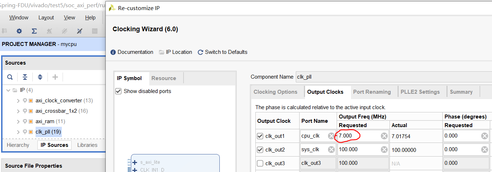
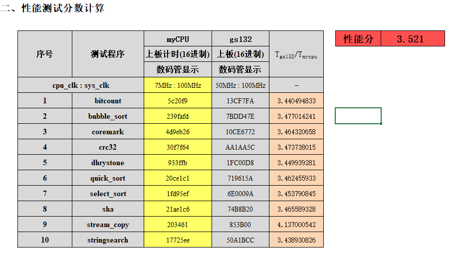

# 挑战课题

## 1 方向一：流水线性能优化

> 预备条件：通过 test1, test2, test3；未实现的指令 decode 为 nop

你将升级你的流水线架构，以获取更高的性能。

通过标准：

* 上板 test1, test2, test3 显示两个绿灯，多次 reset 后仍显示两个绿灯
* 上板 test5 ，时序无违例

评分标准：

* 上板 test5 ，调整开关以运行十个测试，将七段数码管度数记录在 `test5_score.xls` 中，得到综合性能分

打开 `test5` 的 vivado 工程，导入源文件后，你可以调整你的时钟频率。

在 `IP Sources` 中，打开 `clk_pll` ，点击 `Output Clocks` ，修改 `cpu_clk` 的值（上图红圈的内容）为你期望的时钟频率。除了这个值，该 IP 核的其他信息均不允许修改。

生成 bit 文件后，检查是否出现时序违例：

检查上图红圈的值，不允许为负值。图中是合法值。如果出现负值，请降低你的时钟频率。如果是正值，你可以增加时钟频率，以获得更高的分数。

> TIPS: 如果你想知道你的 CPU 合法的最高时钟频率，请将时钟频率调整至一个非常高的值F，确保出现时序违例。生成 bit 文件后，假设 WNS 为 $-t$ ns ($t > 0$)，那么可以通过以下公式估算最高时钟频率：$f_{max} = 1000 / (1000 / F + t)$，其中 F 单位为 MHz , t 单位为 ns。

上板后，先将所有开关往下调。然后，调整右侧的四个开关，让它们表示十进制数 1 到 10 （对应十个测试）。

上图为 `refcpu` 在 7 MHz 的频率下，右侧四个开关表示十进制数1时的上板现象。七段数码管会有一个读数。如果结果为两个绿灯，则将十个测试的读数依次记录到 `test5_scoce.xls` （文件已上传至 elearning，在 `实验部分/` 目录下）里。如果某个测试的结果为红灯，该项成绩填0。

上图是 `refcpu` 在 7 MHz 的频率下，10个测试的读数。填写完读数后，把表格中的时钟频率改成你 CPU 的时钟频率。图中数据所用的 bit 文件已上传至 elearning ， 路径为 `实验部分/refcpu_test5.bit`。

提交内容：待定

DEADLINE：待定

