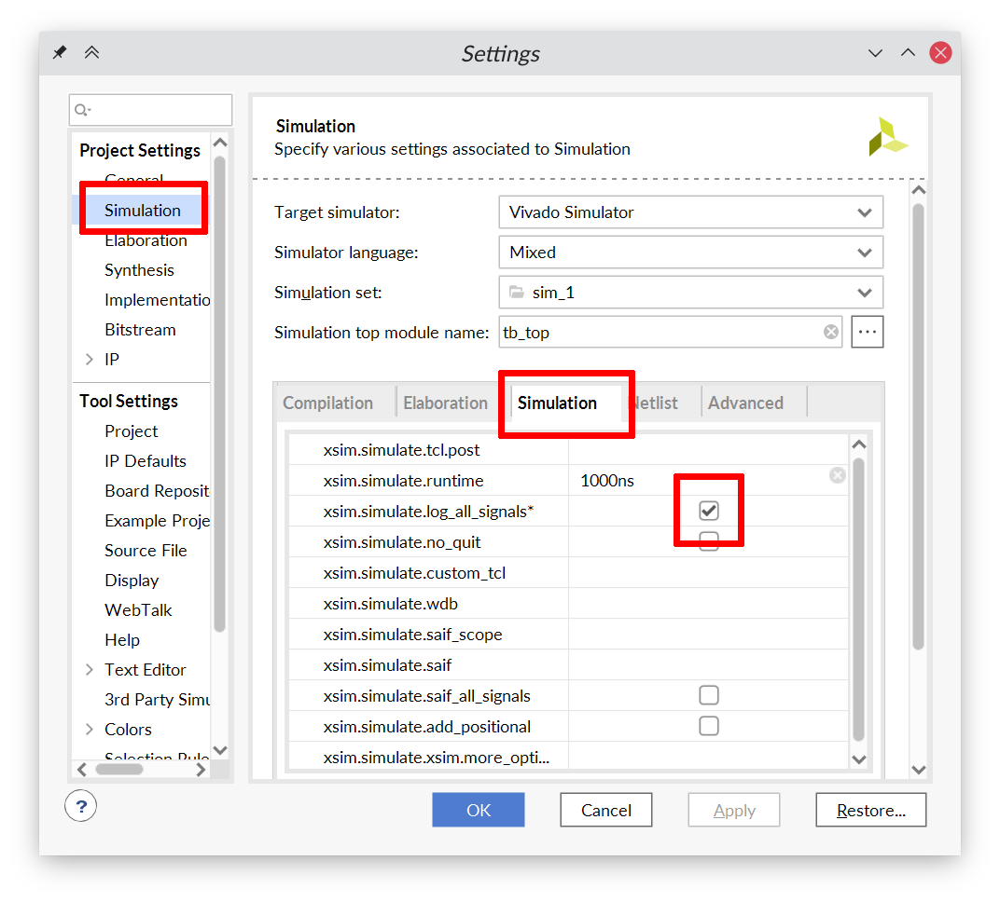

# 常见问题

关于实验内容的答疑，请前往 [FDUCSLG](https://fducslg.slack.com) 的 Slack 平台的 #sig-architecture 频道提问。如果你不想公开提问，可以单独询问助教。

本页面不定期更新。

### 为什么编译时报错 `undefined reference to ...`？

一般是我们更新了代码后会出现这种问题。你可以尝试先 `make clean` 后再重新编译。

### 为什么 Verilator 会报告 `UNOPT`/`UNOPTFLAT`？

这是因为你的代码中可能存在组合逻辑环。请根据 Verilator 输出的文件位置检查是否真的有逻辑环。

如果你认为并不存在逻辑环，并且 Vivado 布线时也没有报告逻辑环，有可能是遇到了 [“组合逻辑环与 `UNOPT`”](misc/unopt.md) 中提到的情形。

### 为什么仿真一直在跑却没有显示 “Functional Test Point PASS!!!”？

有时候你甚至会发现第一个点已经显示通过了，但是第二个点的 “PASS!!!” 一直没有出现。这种情况可能是你的流水线 writeback 阶段没有写入寄存器，导致 trace 没有进行比对，因此也没有发现你 CPU 的错误。

龙芯的测试是在信号 `debug_wb_rf_wen` 不为零的时钟上升沿进行比对。你在仿真的时候可以注意下波形图中 `debug_wb_rf_wen` 这一行是否出现了 `4'hf`，如果出现了则说明 trace 比对正在进行。如果全程为 `0` 则说明你的流水线没有写入寄存器，或者是 `debug_*` 信号连接出错。

### 为什么 Vivado 上的仿真非常慢？要跑十多分钟甚至是一个小时？

我们提供的测试的设置中，默认是会在仿真过程中记录所有的信号。这样在测试不通过时，可以查看所有的信号来寻找问题，方便大家调试。由于 Vivado 自带的 xsim 仿真器本身性能不高，如果需要记录所有的信号，势必会严重拖慢仿真。如果你想加快仿真速度，可以考虑关闭完整的信号记录。

依次点击 Vivado 顶部菜单栏的 “Tools” → “Settings...”，然后在下图所示的窗口中按照红色矩形框的指示，将 `xsim.simulate.log_all_signals` 右侧的勾选框取消。

然后点击 “OK” 保存设置。之后重新启动仿真。

### 我能拿 A 吗？

未来可期。

### 可以退课吗？

耗子尾汁。

### 这课保 B+ 吗？

无可奉告。
