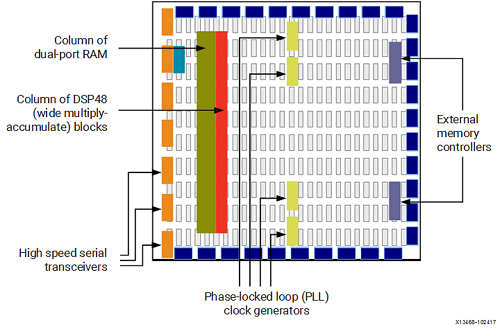
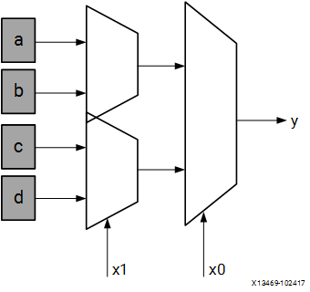
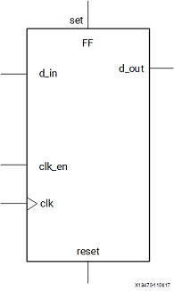

# 了解 FPGA 架构

FPGA（Field Programmable Gate Array）是可编程逻辑阵列的缩写，我们可以在相关计算机软件的帮助下对电路板结构进行编程，来构建我们自己的集成电路板。

在 SDAccel 等工具的帮助下，我们不需要太过关心 FPGA 的底层实现。Vivado 中的综合阶段会将 HDL 代码转换成底层资源启用和相互连接，并在运行阶段刻入 FPGA 开发板中。

但是如果想进一步提升我们编写的硬件的性能，或多或少需要对板上的资源有一些了解。

FPGA 上的基本结构有以下几类：

1. 查找表（Look-Up Table，LUT）：用于实现逻辑运算。
2. 触发器（Flip-Flop，FF）：用于保存 LUT 的运算结果。
3. 电路连接线（wires）：用于连接各部件。
4. IO 板块（Input/Output pads）：负责 FPGA 与外部的数据交互。

这些部件可以组合出最简单的 FPGA 架构，如下图所示：


此结构尽管已经可以实现所有上层架构，但在吞吐量，资源消耗量和时钟频率等指标上有着较大的限制。

**思考**：这些限制来源于哪些物理因素？

当代 FPGA 体系结构将基本部件与其他计算和数据存储模块结合在一起，从而增加了设备的计算密度和效率。

这些其他部件包括：

1. 嵌入式存储器（embedded memories）：用于分布式数据存储。
2. 锁相环（Phase-Locked Loops，PLLs）：用于以不同的时钟频率驱动 FPGA 板上的不同部件。
3. 高速串行收发器（high-speed serial transceivers）：利用编码技术实现高速信号传输。
4. 片外存储器控制器（off-chip memory controllers）。
5. 乘积块（multiply-accumulate blocks）：用于加速实现 $a\leftarrow a+(b\times c)$ 操作。



## 查找表（LUT）

在数字逻辑课上，查找表经常用于分支决策，但 $n$ bit 的查找表还可以看做一个映射表：

$$
f:[0, 2^n-1]\rightarrow A,\ |A| = 2^n
$$

其中 $A$ 为 $2^n$ 个给定的存储单元。

通常情况下，Xilinx FPGA 内部使用 6 bit 的查找表。



**思考**：一个可编程的查找表可实现 $2^{n^n}$ 个不同的映射，为什么？

## 触发器（FF）

数字逻辑课上讲寄存器时，一定讲到锁存器（latch）与触发器（flip flop）。

FPGA 开发板上使用触发器作为在线存储的寄存器。

FF 寄存器最大的特点是当时钟和时钟使能均为 1 时才会锁存新的数据输入并将其输出到输出端口。



**思考**：为什么用触发器而不用锁存器？

## DSP48 模块

在 Xilinx FPGA 最复杂的可用计算模块被称为 DSP48，如下图所示。


DSP48 模块是 FPGA 架构中的嵌入式算数逻辑单元（ALU），其计算链主要可拆分为三个阶段：

加减单元；以上一阶段结果为输入之一的乘法单元；以及最终的加/减/累加单元。

抽象地来看，它可以实现 $P \leftarrow B\times(A+D)+C$ 或 $P \leftarrow P + B\times(A+D)$ 这样的计算功能。

## BRAM 以及其他存储器件

FPGA 开发板上具有可用作随机存取存储器（RAM），只读存储器（ROM）以及移位寄存器等的嵌入式存储元件：Block RAM（BRAM），LUT 和移位寄存器。

BRAM 是一个双端口 RAM 模块，可以提供相对较大的数据保存单元。

FPGA 开发板上有两种大小的 BRAM 存储器：18k 位 BRAM 和 36k 位 BRAM。

这些存储器的双端口性质允许对不同位置进行并行，相同时钟周期的访问。

在 OpenCL 代码中，BRAM 可以直接实现 RAM 和 ROM。

LUTRAM 则是小型存储器，在设备配置期间（即将 bit 文件写入时）会将 LUT 真值表的内容写入其中。

我们可以利用 LUTRAM 实现不同位数的存储器，FPGA 支持在任何部分实例化 LUTRAM，可提高电路性能。


上图是一个移位存储器。

移位寄存器是相互连接的一连串寄存器，该结构的目的是沿计算路径提供数据复用。

例如，基本滤波器由一系列乘法器组成，这些乘法器将数据样本与一组系数相乘。 通过使用移位寄存器存储输入数据，内置的数据传输结构在每个时钟周期将数据样本移至链中的下一个乘法器。

## LUTRAM

在实验 3 中，我们将需要大家使用 LUTRAM 编写 cache line。LUTRAM 的[参考代码](https://github.com/FDUCSLG/ICS-2021Spring-FDU/blob/master/source/ram/LUTRAM.sv)已经放在我们的仓库中了。

从行为级描述来看，LUTRAM 的功能十分清晰：

```verilog
rview_t [NUM_WORDS - 1:0] mem = 0;

assign rdata = mem[addr];

always_ff @(posedge clk)
if (en) begin
	for (int i = 0; i < NUM_WORDS; i++)
    for (int j = 0; j < NUM_LANES; j++) begin
        if (addr == raddr_t'(i) && strobe[j])
            mem[i].lanes[j] <= wdata.lanes[j];
    end
end
```
